# 나만의 프롬프트 관리 프로그램

Python과 Git 기초 학습을 위해 제작한 콘솔 기반 AI 프롬프트 관리 프로그램입니다.

사용자는 터미널에서 메뉴 번호를 입력하여 프롬프트를 추가하고, 목록·카테고리·검색 기능으로 원하는 프롬프트를 확인할 수 있습니다. 즐겨찾기와 조회수 기능을 이용해 자주 사용하는 프롬프트를 관리할 수 있으며, 보너스 기능으로 수정·삭제·조회수 기록·인기 프롬프트 목록을 구현했습니다.

## 1. 주요 기능

### 필수 기능

- 프롬프트 추가
- 전체 프롬프트 목록 조회
- 카테고리별 프롬프트 조회
- 제목 또는 내용 키워드 검색
- 프롬프트 상세 보기
- 즐겨찾기 추가 및 해제
- 즐겨찾기 목록 조회
- 잘못된 메뉴 및 프롬프트 번호 입력 처리
- 프로그램 종료

### 보너스 기능

보너스 2인 **프롬프트 관리(CRUD) 및 사용 기록 기능**을 구현했습니다.

- 프롬프트 수정
- 프롬프트 삭제
- 상세 보기 시 조회수 증가
- 조회수 기준 인기 프롬프트 목록

## 2. 개발 환경

- Visual Studio Code
- Python 3.14.0
- Git 2.55.0
- Windows

Python 3.10 이상에서 실행할 수 있으며, 외부 라이브러리는 사용하지 않았습니다.

### VSCode 개발환경

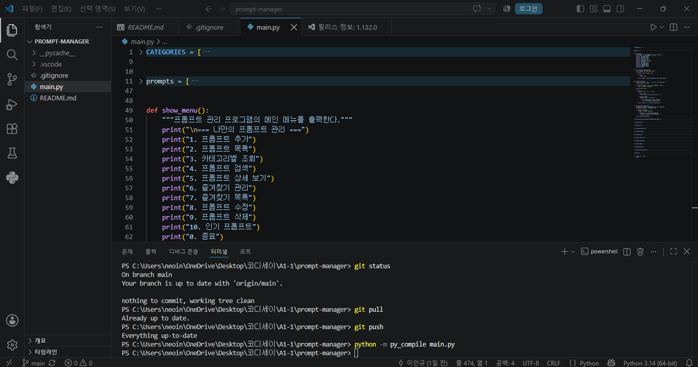

### Python 및 Git 버전

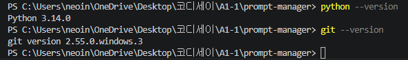

### Git 사용자 설정

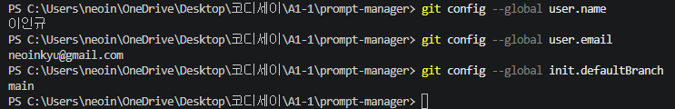

## 3. 실행 방법

### 1) 저장소 복제

```bash
git clone https://github.com/neoinkyu/A1-1.git
```

### 2) 프로젝트 폴더로 이동

```bash
cd prompt-manager
```

### 3) 프로그램 실행

```bash
python main.py
```

## 4. 메뉴 구성

프로그램을 실행하면 다음 메뉴가 표시됩니다.

```text
=== 나만의 프롬프트 관리 ===
1. 프롬프트 추가
2. 프롬프트 목록
3. 카테고리별 조회
4. 프롬프트 검색
5. 프롬프트 상세 보기
6. 즐겨찾기 관리
7. 즐겨찾기 목록
8. 프롬프트 수정
9. 프롬프트 삭제
10. 인기 프롬프트
0. 종료
선택:
```

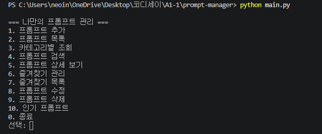

## 5. 기능별 실행 결과

### 5.1 프롬프트 추가

제목, 내용, 카테고리를 입력하여 새로운 프롬프트를 등록할 수 있습니다. 제목이나 내용이 비어 있으면 다시 입력하도록 안내합니다. 카테고리는 기본 목록에서 선택하거나 직접 입력할 수 있습니다.

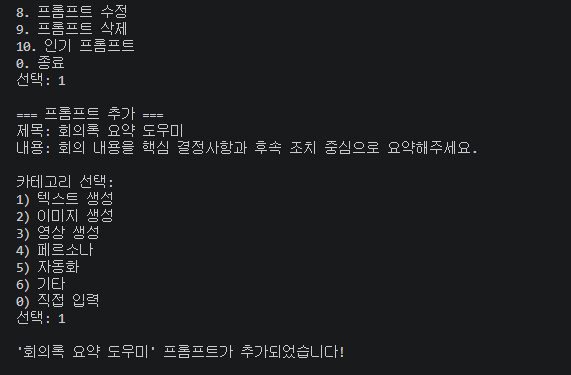

### 5.2 프롬프트 목록

저장된 모든 프롬프트를 번호와 함께 출력합니다. 각 항목에는 카테고리, 제목, 즐겨찾기 여부가 표시됩니다.

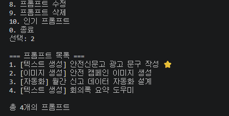

### 5.3 프롬프트 검색

입력한 키워드가 제목 또는 내용에 포함된 프롬프트를 검색합니다.

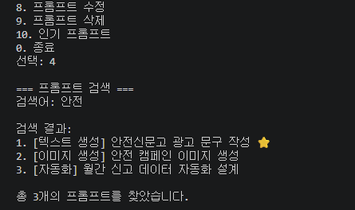

### 5.4 프롬프트 상세 보기 및 조회수 기록

프롬프트 번호를 선택하면 제목, 카테고리, 즐겨찾기 여부, 조회수, 전체 내용을 확인할 수 있습니다. 상세 보기를 실행할 때마다 조회수가 1씩 증가합니다.

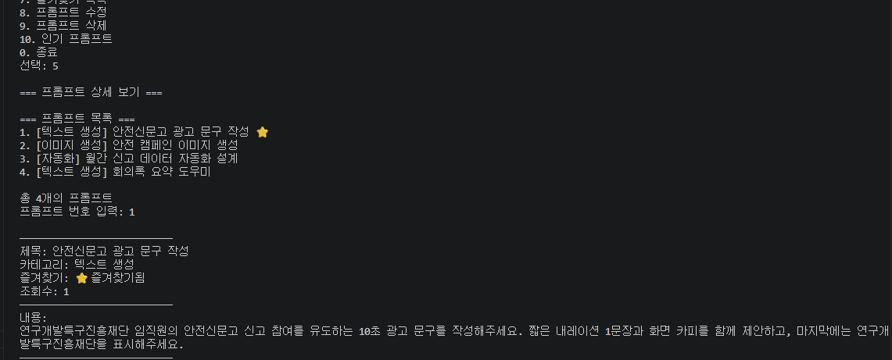

### 5.5 즐겨찾기 관리

프롬프트 번호를 선택하여 즐겨찾기를 추가하거나 해제할 수 있으며, 즐겨찾기된 프롬프트만 별도로 조회할 수 있습니다.

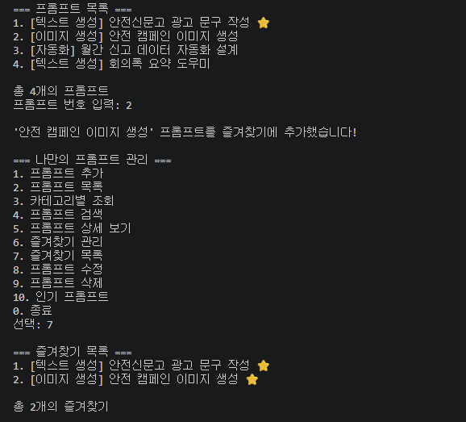

### 5.6 인기 프롬프트

상세 조회수를 기준으로 프롬프트를 내림차순 정렬하여 보여줍니다.

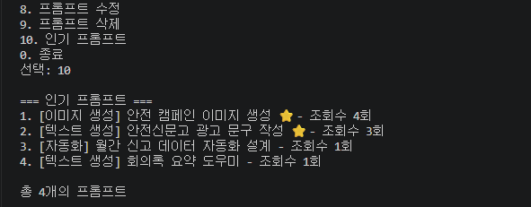

### 5.7 프롬프트 수정

선택한 프롬프트의 제목, 내용, 카테고리를 수정할 수 있습니다. 변경하지 않을 항목은 Enter를 눌러 기존 값을 유지할 수 있습니다.

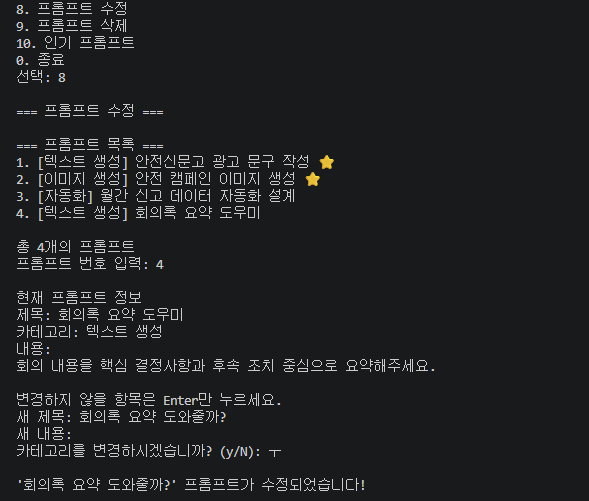

### 5.8 프롬프트 삭제

삭제할 프롬프트를 선택한 뒤 확인 절차를 거쳐 삭제할 수 있습니다.

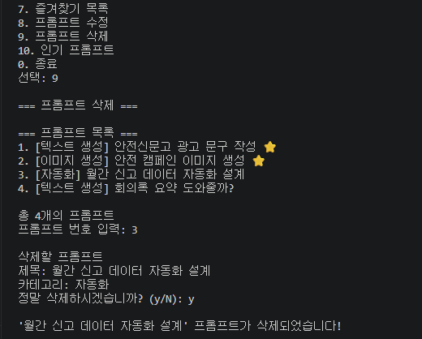

## 6. 프롬프트 데이터 구조

프롬프트는 Python의 리스트와 딕셔너리를 사용하여 관리합니다.

각 프롬프트에는 다음 정보가 저장됩니다.

- `title`: 프롬프트 제목
- `content`: 프롬프트 전체 내용
- `category`: 프롬프트 카테고리
- `favorite`: 즐겨찾기 여부
- `view_count`: 상세 조회 횟수

데이터 구조 예시는 다음과 같습니다.

```python
{
    "title": "안전신문고 광고 문구 작성",
    "content": "안전신문고 참여를 유도하는 광고 문구를 작성해주세요.",
    "category": "텍스트 생성",
    "favorite": True,
    "view_count": 0,
}
```

## 7. 기본 프롬프트

프로그램 시작 시 이전 AI 교육 미션에서 활용한 프롬프트 3개가 기본 데이터로 등록됩니다.

1. 안전신문고 광고 문구 작성
2. 안전 캠페인 이미지 생성
3. 월간 신고 데이터 자동화 설계

## 8. 프롬프트 카테고리

기본 카테고리는 다음과 같습니다.

- 텍스트 생성: 글, 문구, 요약 등 텍스트 결과물을 만드는 프롬프트
- 이미지 생성: 이미지 생성 도구에 입력하는 프롬프트
- 영상 생성: 영상 기획, 장면 구성, 영상 생성용 프롬프트
- 페르소나: AI의 역할과 응답 방식을 설정하는 프롬프트
- 자동화: 반복 업무와 노코드 자동화 절차를 설계하는 프롬프트
- 기타: 기본 분류에 포함되지 않는 프롬프트

프롬프트를 추가할 때 사용자가 새로운 카테고리를 직접 입력할 수도 있습니다.

## 9. 데이터 유지 범위

프로그램 실행 중에는 다음 변경사항이 유지됩니다.

- 새로 추가한 프롬프트
- 수정 또는 삭제한 프롬프트
- 즐겨찾기 상태
- 상세 조회수

프로그램을 종료하면 데이터는 기본 상태로 초기화됩니다.

## 10. 프로젝트 구조

```text
prompt-manager/
├── .gitignore
├── README.md
├── main.py
└── prompt-manager_제출자료/
    ├── 01_VSCode_개발환경.png
    ├── 02_Python_Git_버전.png
    ├── 03_Git_사용자설정.png
    ├── 04_프로그램_메인메뉴.png
    ├── 05_프롬프트_추가.png
    ├── 06_프롬프트_목록.png
    ├── 07_프롬프트_검색.png
    ├── 08_프롬프트_상세조회.png
    ├── 09_즐겨찾기_목록.png
    ├── 10_인기_프롬프트.png
    ├── 11_프롬프트_수정.png
    ├── 12_프롬프트_삭제.png
    ├── 13_Git_로그그래프.png
    ├── 14_GitHub_저장소.png
    └── GitHub_URL.txt
```

## 11. Git 및 GitHub 활용

프로젝트 개발 과정에서 다음 Git 기능을 사용했습니다.

- 저장소 초기화: `git init`
- 변경사항 추가: `git add`
- 기능 단위 기록: `git commit`
- 원격 저장소 업로드: `git push`
- 원격 변경사항 확인: `git pull`
- 공개 저장소 복제: `git clone`
- 기능 브랜치 생성 및 이동: `git checkout`
- 기능 브랜치 병합: `git merge`

프롬프트 목록 기능은 `feature/prompt-list` 브랜치에서 개발한 뒤 `main` 브랜치로 병합했습니다.

### Git 로그 그래프

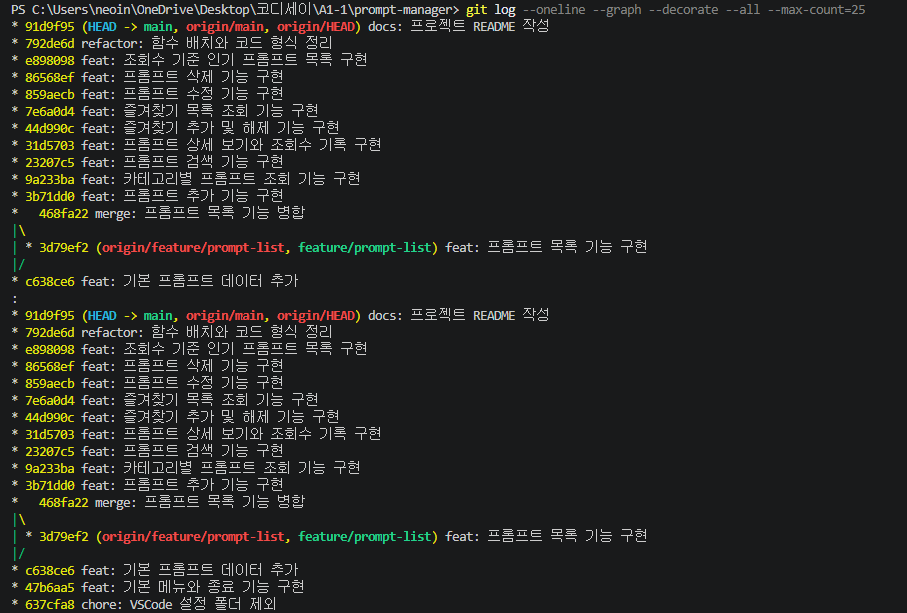

### GitHub 저장소

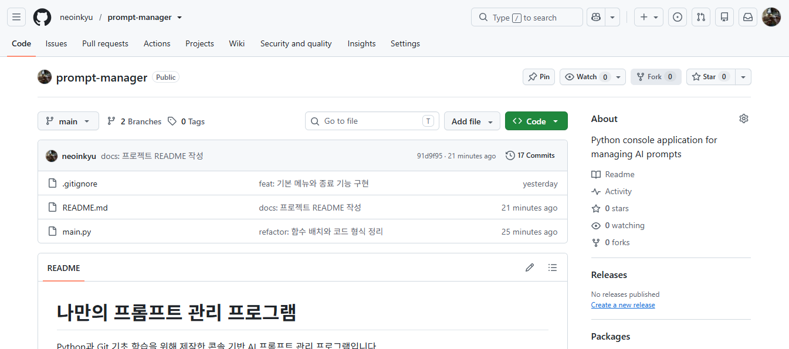

## 12. 저장소 주소

https://github.com/neoinkyu/A1-1
